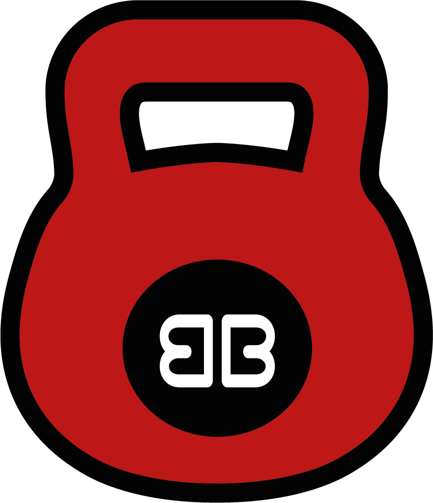
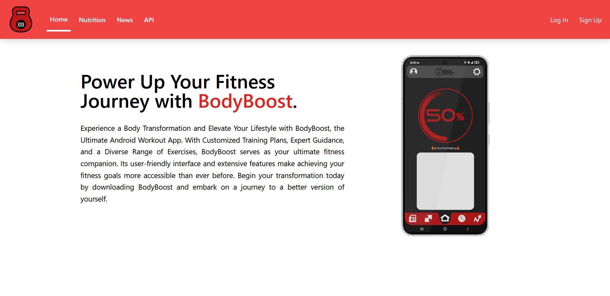
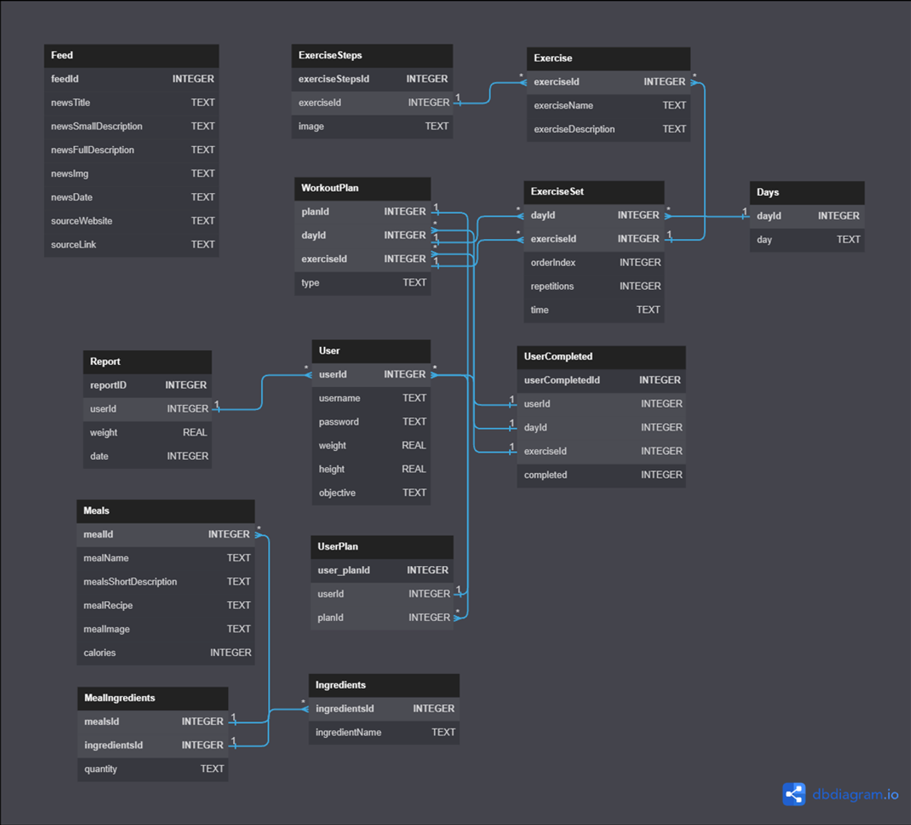
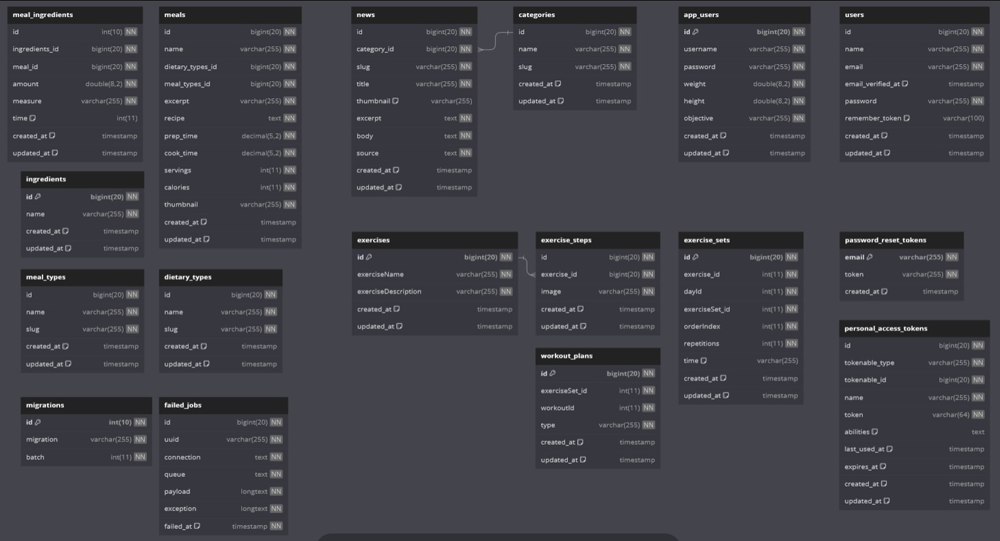

[![Contributors][contributors-shield]][contributors-url]
[![Forks][forks-shield]][forks-url]
[![Stargazers][stars-shield]][stars-url]
[![Issues][issues-shield]][issues-url]
[![MIT License][license-shield]][license-url]


<br />

<div align="center">
   
</div>
  <h3 align="center">BodyBoost</h3>

  <p align="center">
    Bodyboost is a project focused in providing healthy meals, sports news and workout plans to people who can't go to a gym or get dietary advice by other means.
    <br />
    <a href="https://github.com/JOao7640/BodyBoost-Android-App"><strong>Explore the docs »</strong></a>
    <br />
    <br />
    <a href="https://joao7640.github.io/BodyBoost-Android-App/demo.html">View Demo</a>
    ·
    <a href="https://github.com/JOao7640/BodyBoost-Android-App/issues">Report Bug</a>
    ·
    <a href="https://github.com/JOao7640/BodyBoost-Android-App/issues">Request Feature</a>
  </p>
</div>

### Introduction

The project has a mobile application and website for exercise and healthy meals aimed at people who can't go to a gym or get dietary advice by other means. The project is focused in an API powered mobile app and the API itself. The mobile app provides meals, news and exercise plans as well as user registration and log-in.

### Demo

<div align="center">
   
</div>
Take a look at the <a href="https://joao7640.github.io/BodyBoost-Android-App/demo.html">Demo</a>
 of the website's homepage where we present our ideas about the project, the application's functionalities and more.

### Functionalities

- Comercial website with meals, news and API documentation
- Responsive website
- Strong Laravel API
- API powered mobile app developed with Java in Android Studio
- Subscribe to the websites newsletter from them MailChimp API

### Built With

* [![Java][java.com]][java-url]
* [![Laravel][Laravel.com]][Laravel-url]
* [![Tailwind][tailwindcss.com]][tailwind-url]

<!-- ROADMAP -->
### Roadmap

- [X] Code the structure of the inicial menu
  - [X] Make the progress bar functional
    - [X] Style the progress bar 
  - [X] Make the navigation bar functional
    - [X] Style the navigation bar 
  - [X] Make the cards functional
    - [X] Style the cards 
- [X] Code the structure of the user profile
  - [X] Let him change his personal data
  
- [X] Code the structure of the workout list section
    - [X] Display the exercises corresponding to the users goal

- [X] Code the structure of the meal list section
  - [X] Make the "meals information" option functional
  
- [X] Code the structure of the statistics menu
  - [X] Make the weight list functional

- [X] Code the structure of the feed menu
  - [X] Make the "news consulting" option functional

- [X] Code the websites home page
  - [X] Style it with TailwindCSS

- [X] Connect the website to the MailChimp API
  - [X] Style the section in the website

- [X] Code the websites meals page
  - [X] Style it with TailwindCSS

- [X] Code the websites news page
  - [X] Style it with TailwindCSS

- [X] Code the admin dashboard
  - [X] Style it with TailwindCSS
  - [X] Implement the middleware for security

- [X] Code the Laravel API and its endpoints
 - [X] Connect the app to the Laravel API

<!-- Database Structure -->
### Database Structure

#### Room Database
In the depicted image, we have meticulously established the foundational elements for a Room Database within our Android application.
<div align="center">
   
</div>

#### External Database
In the provided image, we have diligently laid the groundwork for the core components of an external database integration.
<div align="center">
   
</div>

<!-- API Documentation -->
### API Documentation

#### Return all meals

```
  GET /api/meals
```

| Type       | Description                           |
| :--------- | :---------------------------------- |
| `Array` | Returns all the meals with its informations |

#### Return the ingredients of a certain meal

```
  GET /api/meals/{id}/ingredients
```

| Type       | Description                                   |
| :--------- | :------------------------------------------ |
| `Array` | **Mandatory:** Must pass the id of the meal |

#### Return the relations between the ingredient and the meal

```
  GET /api/meals/{id}/meal-ingredients
```

| Type       | Description                                   |
| :--------- | :------------------------------------------ |
| `Array` | **Mandatory:** Must pass the id of the meal |


#### Return all news

```
  GET /api/news
```

| Type       | Description                                   |
| :--------- | :------------------------------------------ |
| `Array` | Retuns all the news with its informations |


### Installation and setup
To completely use our project follow the following steps.

1. Clone the repo
   ```sh
   git clone https://github.com/JOao7640/BodyBoost-Android-App.git
   ```
2. Install Xampp
   <a href="https://www.apachefriends.org/">XAMPP</a>
3. Create the database "BodyBoost" in XAMPPs PHPMyAdmin page
4. After that open the folder you cloned the repo to and navigate to **website/bodyboost** and execute the following command
   ```sh
      php artisan migrate
   ```
5. After migrating the database import the data from the **bodyboost.sql** file
6. Start the application
   ```sh
      php artisan serve
   ```
7.  Install and setup Android Studio
   <a href="https://developer.android.com/studio?hl=pt-br">Android Studio</a>
8. Start the Android Studio emulator and enjoy : )

<!-- CONTRIBUTING -->
## Contributing

Bodyboost is open source so feel free to create, inspire and learn amazing things with the comunity of our project. Any contributions you make are **greatly appreciated**.

If you have a suggestion that would make this better, please fork the repo and create a pull request. You can also simply open an issue with the tag "enhancement".
Don't forget to give the project a star! Thanks again!

1. Fork the Project
2. Create your Feature Branch (`git checkout -b feature/AmazingFeature`)
3. Commit your Changes (`git commit -m 'Add some AmazingFeature'`)
4. Push to the Branch (`git push origin feature/AmazingFeature`)
5. Open a Pull Request

## License
Distributed under the MIT License. See `LICENSE.txt` for more information.


## Authors

- [@joao7640](https://www.github.com/joao7640)
- [@SaiNt._.LuKe](https://github.com/IM-SaiNt-LuKe)

<!-- MARKDOWN LINKS & IMAGES -->
<!-- https://www.markdownguide.org/basic-syntax/#reference-style-links -->
[contributors-shield]: https://img.shields.io/github/contributors/JOao7640/BodyBoost-Android-App.svg?style=for-the-badge
[contributors-url]: https://github.com/JOao7640/BodyBoost-Android-App/graphs/contributors
[forks-shield]: https://img.shields.io/github/forks/JOao7640/BodyBoost-Android-App.svg?style=for-the-badge
[forks-url]: https://github.com/JOao7640/BodyBoost-Android-App/network/members
[stars-shield]: https://img.shields.io/github/stars/JOao7640/BodyBoost-Android-App.svg?style=for-the-badge
[stars-url]: https://github.com/JOao7640/BodyBoost-Android-App/stargazers
[issues-shield]: https://img.shields.io/github/issues/JOao7640/BodyBoost-Android-App.svg?style=for-the-badge
[issues-url]: https://github.com/JOao7640/BodyBoost-Android-App/issues
[license-shield]: https://img.shields.io/github/license/JOao7640/BodyBoost-Android-App.svg?style=for-the-badge
[license-url]: https://github.com/JOao7640/BodyBoost-Android-App/blob/master/LICENSE.txt


[Laravel.com]: https://img.shields.io/badge/Laravel-FF2D20?style=for-the-badge&logo=laravel&logoColor=white
[Laravel-url]: https://laravel.com
[tailwindcss.com]: https://img.shields.io/badge/tailwindcss-0F172A?&logo=tailwindcss
[tailwind-url]: https://tailwindcss.com
[java.com]: https://img.shields.io/badge/Java-ED8B00?style=for-the-badge&logo=openjdk&logoColor=white
[java-url]: https://java.com 
